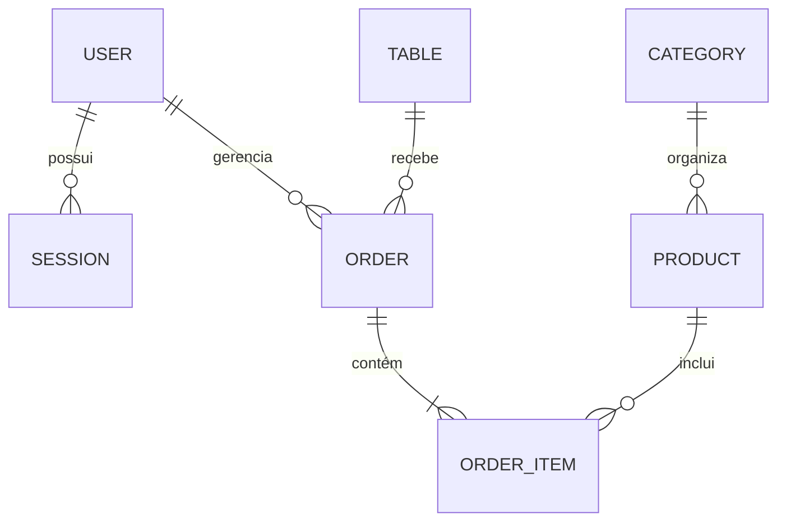

O seu `README.md` está excelente e com uma narrativa de evolução muito clara! Como agora você adicionou o **RBAC (Script 05)** e corrigiu problemas reais de **Drift de Banco** e **Tipagem**, fiz alguns ajustes estratégicos para incluir essas melhorias técnicas e atualizar a numeração.

Aqui está a versão refinada e profissional:

---

# 🧱 🥇 Script 01 — Base & Estrutura (The Foundation)
**Foco:** Setup inicial e conexão.

* **O que ele faz:**
    * Scaffold do NestJS e instalação de dependências.
    * Configuração do **Prisma ORM** com PostgreSQL.
    * Definição do modelo `User` e `Role` (Enum).
    * Configuração de um **Swagger** funcional.
* **Resultado:** Uma API funcional com CRUD de usuários e banco de dados conectado.
* **Nível:** 🟢 **Iniciante / Boilerplate**

---

# 🔐 🥈 Script 02 — Autenticação & Argon2 (Security First)
**Foco:** Troca de segurança básica por criptografia moderna.

* **O que ele adiciona:**
    * Migração de Bcrypt para **Argon2** (vencedor do *Password Hashing Competition*).
    * Estrutura de `AuthService` com validação de credenciais.
    * Geração de par de tokens (Access + Refresh).
* **Resultado:** Senhas protegidas contra ataques de força bruta de última geração.
* **Nível:** 🟡 **Pleno / Seguro**

---

# 🏦 🥉 Script 03 — Gestão de Sessões (Fintech Grade)
**Foco:** Multi-device e controle total de acessos.

* **O que ele muda:**
    * **Multi-device:** De 1 usuário por token para 1 usuário com **N sessões** simultâneas.
    * **Refresh Token Rotation:** Invalida o token antigo a cada renovação, prevenindo roubo de sessão.
    * **Detecção de Reuso:** Se um token antigo for reutilizado, o sistema revoga **todas** as sessões por segurança.
* **Resultado:** Segurança nível bancário com auditoria de IP e UserAgent.
* **Nível:** 🔴 **Fintech / SaaS Enterprise**

---

# 📘 🧾 Script 04 — Swagger & DX (Developer Experience)
**Foco:** Transformar código em um produto consumível.

* **O que ele faz:**
    * Implementa **DTOs de Resposta** para padronizar o que a API devolve.
    * Adiciona decorators `@ApiOperation` e `@ApiResponse`.
    * Configura o botão **Authorize (JWT)** no Swagger.
    * Resolve problemas de tipagem com **Prisma Client Generation**.
* **Resultado:** Uma documentação que permite testar todo o fluxo de auth pelo navegador.
* **Nível:** 🔵 **Profissional / Documentado**

---

# 🛡️ 🎖️ Script 05 — RBAC & Governança (Admin Level)
**Foco:** Controle de acesso baseado em hierarquia.

* **O que ele adiciona:**
    * **RolesGuard:** Um motor de autorização que lê o cargo do usuário no token.
    * **Decorador @Roles:** Permite fechar rotas apenas para `ADMIN` ou `MANAGER`.
    * **Módulo Admin:** Endpoints protegidos para gestão sensível.
    * **Resiliência de Banco:** Automação de `db push` e `resolve` para evitar perda de dados e erros de *Drift*.
* **Resultado:** Controle absoluto sobre "quem pode o quê" dentro do sistema.
* **Nível:** 🔥 **Architect / Senior**

---

# 🧠 VISÃO GERAL (Tabela de Evolução)

| Script    | Objetivo Principal                | Tecnologia Chave       | Nível          |
| --------- | --------------------------------- | ---------------------- | -------------- |
| Script 01 | Estrutura & Banco                 | NestJS + Prisma        | 🟢 Iniciante   |
| Script 02 | Autenticação Robusta              | Argon2 + JWT           | 🟡 Pleno       |
| Script 03 | Sessões & Multi-device            | Session Table + ROT    | 🔴 Fintech     |
| Script 04 | Documentação & Tipagem            | Swagger + DTOs         | 🔵 Profissional|
| Script 05 | Autorização (RBAC)                | Guards + Decorators    | 🛡️ Senior      |

---

# 🧩 Como a Segurança se Camufla (Fluxo da Requisição)


1. **Req** ➡️ `JwtAuthGuard` (Você é quem diz ser?)
2. ➡️ `RolesGuard` (Você tem permissão para entrar aqui?)
3. ➡️ `Controller` (Lógica de Negócio)
4. ⬅️ **Res**

---

# 🚀 Status Atual do Projeto
* ✅ Autenticação com Argon2.
* ✅ Refresh Token Rotation (Sessões persistentes).
* ✅ RBAC (Admin/Manager/User).
* ✅ Swagger 100% funcional.
* ✅ Sincronização de banco sem perda de dados (`db push`).

---

# 📖 🍕 Script 06 — Gestão de Cardápio (Menu Engine)
**Foco:** Estruturação de produtos e categorias.

* **O que ele adiciona:**
    * CRUD completo de Categorias e Produtos.
    * Relacionamento 1:N entre Categorias e Itens.
    * Validação de integridade (Não cria produto sem categoria válida).
* **Resultado:** Catálogo de vendas pronto para consumo.

---

# 🪑 🏁 Script 07 — Salão & Disponibilidade (Table Management)
**Foco:** Controle físico e estados das mesas.

* **O que ele adiciona:**
    * Gestão de status: `FREE`, `OCCUPIED`, `RESERVED`.
    * Endpoints de filtragem inteligente (listar apenas mesas livres).
    * Bloqueio de duplicidade de numeração.
* **Resultado:** Controle em tempo real do salão do restaurante.

---

# 📝 💰 Script 08 — Motor de Pedidos (Transaction Engine)
**Foco:** O coração financeiro da aplicação.

* **O que ele implementa:**
    * **Snapshot de Preço:** Grava o preço do produto no momento da venda (proteção contra reajustes futuros).
    * **Transações Atômicas:** Abre o pedido e ocupa a mesa simultaneamente (ou falha ambos).
    * **Cálculo Automático:** Atualiza o valor total da conta a cada item adicionado.
* **Nível:** 💹 **Financeiro / Robusto**

---

# 👨‍🍳 🥂 Script 09 — Workflow de Cozinha & Fechamento
**Foco:** Ciclo de vida do atendimento e automação.

* **O que ele finaliza:**
    * **Fila da Cozinha:** Endpoint exclusivo para o `CHEF` visualizar pedidos pendentes.
    * **Transição de Status:** `PENDING` ➡️ `PREPARING` ➡️ `READY`.
    * **Auto-Release:** Ao fechar a conta (`CLOSED`), a mesa é liberada automaticamente para o próximo cliente.
* **Resultado:** Sistema ponta a ponta (End-to-End) operacional.

---

# 🗺️ Arquitetura do Banco de Dados (ERD)



---

# 🛠️ Como Executar o Projeto Completo

### 1. Requisitos
* Node.js 20+
* Docker (para o PostgreSQL) ou Banco Local

### 2. Instalação & Setup
```bash
# Instalar dependências
npm install

# Configurar variáveis de ambiente (.env)
cp .env.example .env

# Sincronizar banco e gerar tipos (Resiliência do Script 05)
npx prisma db push
npx prisma generate
```

### 3. Rodar a API
```bash
npm run start:dev
```

### 4. Documentação (Swagger)
Acesse: `http://localhost:3000/api` para testar todos os fluxos, desde o Login até o fechamento de pedidos.

---

# 🚀 Tecnologias Utilizadas
* **Backend:** [NestJS](https://nestjs.com/)
* **ORM:** [Prisma](https://www.prisma.io/)
* **Database:** [PostgreSQL](https://www.postgresql.org/)
* **Segurança:** [Argon2](https://github.com/ranisalt/node-argon2), [Passport-JWT](http://www.passportjs.org/)
* **Documentação:** [Swagger/OpenAPI](https://swagger.io/)

---
