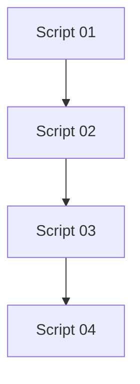

Boa — agora vale organizar isso porque você já tem um **pipeline completo de backend profissional**. Vou te explicar **cada script de forma clara e prática**, como se fosse uma evolução de maturidade.

---

# 🧱 🥇 Script 01 — Base do projeto (setup inicial)

### 👉 O que ele faz:

* Cria projeto NestJS
* Instala dependências principais
* Configura:

  * Prisma
  * PostgreSQL
  * Swagger básico
* Cria:

  * `User` module
  * `PrismaService`
  * DTOs básicos

---

### 🧠 Resultado:

Você tem uma API que:

✅ roda
✅ conecta no banco
✅ cria usuários
✅ tem Swagger básico

👉 **Nível: iniciante / boilerplate**

---

# 🔐 🥈 Script 02 — Auth profissional (JWT + refresh simples)

### 👉 O que ele adiciona:

* Módulo `auth`
* Login e registro
* JWT (access token)
* Refresh token (salvo no user)
* Guards (`JwtAuthGuard`)
* Roles (RBAC básico)

---

### 🧠 Resultado:

Agora sua API tem:

✅ autenticação
✅ rotas protegidas
✅ controle de acesso (roles)
✅ refresh token simples

👉 **Nível: backend pleno**

---

# 🏦 🥉 Script 03 — Auth nível fintech

### 👉 O que ele muda completamente:

Sai de:

```
1 usuário = 1 refresh token
```

Para:

```
1 usuário = N sessões (multi-device)
```

---

### 🔥 Ele implementa:

#### 1. Sessions no banco

```ts id="sessionsmodel"
Session {
  userId
  refreshToken (hash)
  ip
  userAgent
  revoked
}
```

---

#### 2. Refresh Token Rotation

* Cada refresh:

  * invalida o token antigo
  * cria um novo

---

#### 3. Proteção contra ataque (token reuse)

Se alguém tentar usar um token antigo:

💣 sistema detecta
💣 revoga TODAS sessões
💣 força relogin

---

#### 4. Multi-device

Você pode ter:

* celular
* notebook
* tablet

cada um com sessão própria

---

#### 5. Logout real

* logout de 1 sessão
* logout global

---

### 🧠 Resultado:

✅ segurança de nível bancário
✅ controle total de sessões
✅ proteção contra roubo de token
✅ arquitetura escalável

👉 **Nível: fintech / SaaS grande**

---

# 📘 🧾 Script 04 — Swagger profissional

### 👉 O que ele faz:

Não muda lógica — melhora **DX (developer experience)**

---

### 🔥 Ele adiciona:

* DTO de resposta (`AuthResponseDto`)
* documentação completa nos endpoints
* descrições (`@ApiOperation`)
* respostas (`@ApiResponse`)
* botão **Authorize (JWT)** no Swagger
* persistência do token

---

### 🧠 Resultado:

✅ API auto-documentada
✅ testável no browser
✅ padrão empresa (tipo Stripe, Nubank)

👉 **Nível: documentação profissional**

---

# 🧠 VISÃO GERAL (evolução)

| Script    | Foco                          | Nível           |
| --------- | ----------------------------- | --------------- |
| Script 01 | Base + Prisma + Swagger       | 🟢 Iniciante    |
| Script 02 | Auth JWT + RBAC               | 🟡 Pleno        |
| Script 03 | Segurança avançada (sessions) | 🔴 Fintech      |
| Script 04 | Documentação Swagger          | 🔵 Profissional |

---

# 🧩 Como eles se encaixam



---

# 💡 Tradução simples (bem direta)

* **Script 01** → “faz funcionar”
* **Script 02** → “tem login”
* **Script 03** → “é seguro de verdade”
* **Script 04** → “é usável por outros devs”

---

# 🚀 Se você já rodou todos

Você já tem:

* 🔐 sistema de auth nível fintech
* 🧱 arquitetura sólida
* 📘 documentação profissional
* 🐳 pronto pra produção

---

# 💣 Próximo nível (se quiser evoluir mais ainda)

Posso te levar pra:

* ☁️ deploy real (AWS / GCP / Fly.io)
* 📊 observabilidade (logs + tracing)
* 🧪 testes automatizados completos
* ⚡ performance (Redis + cache)
* 🔐 RBAC avançado (permissões granulares)

Só fala:
👉 **“quero virar senior de backend”**
